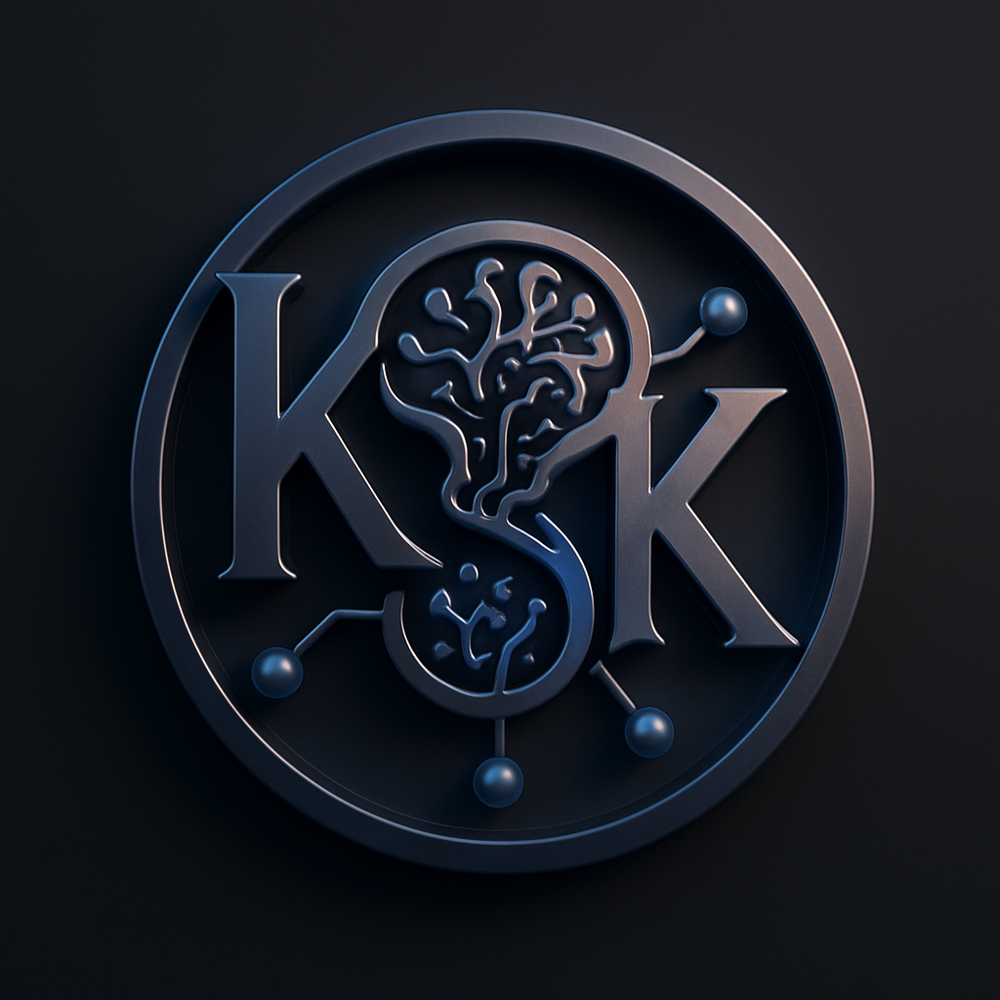

 

  

 

##  About Me

👋 **Hi there! I'm Kayam Sai Krishna**, an AI/ML Engineer passionate about building production-ready intelligent systems. I specialize in Large Language Models (LLMs) and Generative AI to solve complex real-world challenges.

📍 **Location:** Bangalore, India 🇮🇳
🎓 **Education:** B.Tech in AI & Machine Learning
💼 **Role:** AI/ML Engineer Intern @ Ziti
🚀 **Current Focus:** Building Scalable RAG Architectures & Multi-Agent Systems
💡 **Philosophy:** Transforming Complexity into Elegant, Efficient Solutions

 

##  Tech Stack & Tools

### Programming Languages

  
  
  
  
  
  
  

### AI/ML & Deep Learning

  
  
  
  
  
  
  
  
  
  
  

### LLM & Generative AI

  
  
  
  
  
  
  

### Cloud & DevOps

  
  
  
  
  
  
  

 

##  Core Expertise

### 🤖 Generative AI & LLMs
- **Multi-Agent Systems:** Architecting collaborative AI agent workflows using LangGraph.
- **Optimization:** Fine-tuning large models (LoRA/QLoRA) and prompt engineering.
- **RAG:** Building robust Retrieval-Augmented Generation pipelines with Vector DBs.

### 🧠 Deep Learning & Computer Vision
- **Industrial AI:** Developing custom vision models for high-precision defect detection.
- **Architectures:** Designing custom Transformers and CNNs for specialized tasks.
- **MLOps:** Managing the full lifecycle from data engineering to production deployment.

 

##  Professional Experience

### **Ziti** | AI/ML Engineer Intern
*Dec 2025 — Present | Bengaluru (Remote)*
- Designing and integrating advanced AI/ML systems for high-impact real-world use cases.
- Building robust ML pipelines to automate data flows and improve model accuracy.
- Architecting end-to-end workflows for data-driven features, ensuring production-level scalability.
- Collaborating across tech and product teams to translate complex requirements into scalable AI solutions.

 

### **Freelance** | AI/Engineering Solutions Developer
*2024 — Present | Self-Employed*
- Worked on multiple freelancing projects in the engineering domain focusing on manufacturing, design, and quality. 
- Delivered AI-powered applications including personalized AI assistants, industrial inspection systems, and data-driven decision-making tools.
- **Stack:** AI/ML, Python, Computer Vision, Product Design, Quality Engineering.

 

### **Federal-Mogul Goetze (Tenneco)** | AI/ML Intern
*July 2025 | Bengaluru*
- Worked on AI-powered systems for metallurgical microstructure analysis and coating thickness measurement using advanced image processing techniques.
- Optimized model inference speed, achieving real-time performance on edge devices.
- Collaborative development of MLOps pipelines for continuous model improvement.

 

##  Certifications & Achievements

🚀 **HAL AEROTHON'25** | *HAL & PES University*
- Developed an AI-powered EO/IR video classification system for multi-domain surveillance (Ground, Air, Maritime). Focused on real-time threat detection using computer vision and deep learning (YOLO).

🌌 **HackVerse’25** | *MAHE & IBM, AWS*
- Recognized for exceptional performance in technology problem-solving, innovation, and teamwork.

🎓 **Key Certifications:**
- **AI with Machine Learning** (Ethical Edufabrica & IISc Bangalore)
- **Introduction to Large Language Models** (NPTEL)
- **Master in Generative AI** (Udemy)
- **Full Stack Web Development with MERN & GenAI** (Udemy)
- **User Experience Design - Figma** (Udemy)
- **Machine Learning with Python** (IBM)
- **Python 101 for Data Science** (IBM)

 

##  GitHub Statistics

 

 

##  Let's Connect & Collaborate

 

<table align="center" style="border: none;">
  <tr>
    <td align="center" style="border: none;">
       
      <b>Email</b> 
      <a href="mailto:kayamsaikrishna@gmail.com">kayamsaikrishna@gmail.com</a>
    </td>
    <td width="30" style="border: none;"></td>
    <td align="center" style="border: none;">
       
      <b>Phone</b> 
      +91-8088993690
    </td>
    <td width="30" style="border: none;"></td>
    <td align="center" style="border: none;">
       
      <b>Location</b> 
      Bangalore, India
    </td>
  </tr>
</table>

 

### I'm always open to exciting AI/ML opportunities!

 

  

*"Building intelligent systems that solve real-world problems, one model at a time"*

 

⭐ **If you find my work interesting, feel free to star my repositories!** ⭐

