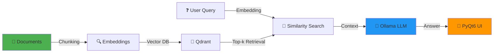
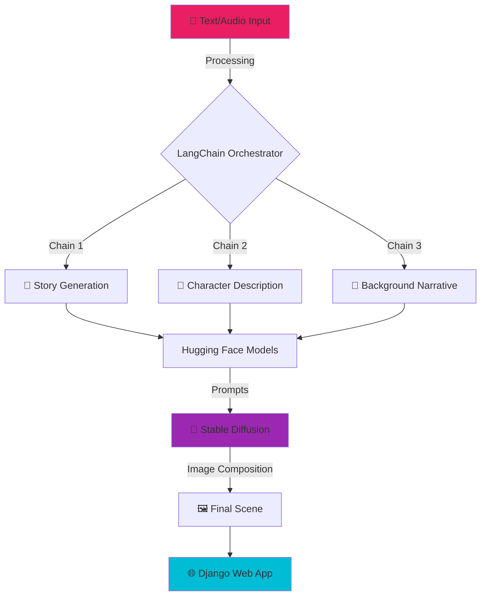

<div align="center">
  
# 👋 Hey there, I'm Kayam Sai Krishna


[](https://www.linkedin.com/in/kayam-sai-krishna-675792326/)
[](https://kayam-sai-krishna-aiml-portfolio.netlify.app/)
[](mailto:kayamsaikrishna@gmail.com)
[](https://github.com/kayamsaikrishna)

</div>

---

## 🚀 About Me

```python
class AIEngineer:
    def __init__(self):
        self.name = "Kayam Sai Krishna"
        self.role = "AI/ML Engineering Student"
        self.education = "B.Tech in CSE - AI & ML"
        self.location = "Bangalore, India"
        self.interests = ["Large Language Models", "Deep Learning", 
                         "Computer Vision", "RAG Systems"]
        
    def current_focus(self):
        return [
            "🤖 Building production-ready LLM applications",
            "🔍 Exploring Retrieval-Augmented Generation",
            "🧠 Fine-tuning transformer models",
            "⚡ Optimizing AI model deployment"
        ]
    
    def say_hi(self):
        print("Thanks for dropping by! Let's build something amazing together!")

me = AIEngineer()
me.say_hi()
```

---

## 💼 What I Do

<table>
<tr>
<td width="50%">

### 🧠 AI & Machine Learning
- **Large Language Models** (GPT, BERT, T5)
- **Natural Language Processing**
- **Computer Vision** with CNNs
- **Generative AI** & RAG Systems
- **Model Fine-tuning** & Optimization

</td>
<td width="50%">

### 🛠️ Development & Deployment
- **PyTorch** & **TensorFlow** Ecosystems
- **LangChain** for LLM Orchestration
- **Docker** for Containerization
- **REST APIs** with Flask & Django
- **Cloud Deployment** (AWS)

</td>
</tr>
</table>

---

## 🔥 Featured Projects

<div align="center">

### 🔐 InfoMind - Private RAG Document Search System
[](https://github.com/kayamsaikrishna)

**Secure Retrieval-Augmented Generation for private document Q&A**

</div>



**Tech Stack:** `Ollama` `Qdrant` `PyQt6` `Docker` `LangChain`

**Key Features:**
- 🔒 Fully offline, privacy-first architecture
- ⚡ Real-time streaming responses
- 🎯 High-accuracy semantic search
- 📦 Docker containerized for portability

---

<div align="center">

### 🎨 AI Story Generator - Multi-Modal Creative System
[](https://github.com/kayamsaikrishna)

**End-to-end generative AI pipeline for illustrated storytelling**

</div>



**Tech Stack:** `LangChain` `Stable Diffusion` `Hugging Face` `Django` `OpenCV`

**Key Features:**
- 🎭 Multi-chain AI workflow orchestration
- 🎨 Character & scene image generation
- 🔄 Real-time generation tracking
- 👨‍💼 Admin review & approval system

---

## 🛠️ Tech Stack

<div align="center">

### Languages & Frameworks


### AI & ML Tools


### Databases & Vector Stores


### Development Tools


</div>

---

## 📊 GitHub Analytics

<div align="center">
  


</div>

---

## 🏆 Certifications & Training

<table>
<tr>
<td width="50%">

### 🎓 Certifications
- **AI with Machine Learning**  
  *IISc Bangalore & Ethical Edufabrica*  
  `November 2023`

- **Introduction to Large Language Models**  
  *NPTEL*  
  `April 2025`

</td>
<td width="50%">

### 💼 Professional Training
- **Metallurgical Quality Control**  
  *Federal-Mogul Goetze (Tenneco)*  
  `July 2025`
  
  *Developed AI-powered systems for industrial quality control and defect detection*

</td>
</tr>
</table>

---

## 🎯 Core Competencies

<div align="center">

| Domain | Technologies & Skills |
|--------|----------------------|
| 🤖 **Deep Learning** | CNNs, RNNs, Transformers, Attention Mechanisms, Transfer Learning |
| 📝 **NLP** | Tokenization, Embeddings, Named Entity Recognition, Sentiment Analysis |
| 🧠 **LLMs** | GPT, BERT, T5, Fine-tuning, Prompt Engineering, RLHF |
| 🔍 **RAG Systems** | Vector Databases, Semantic Search, Document Retrieval, Context Management |
| 🎨 **Generative AI** | Stable Diffusion, Image Generation, Text-to-Image, Multi-modal AI |
| ⚙️ **MLOps** | Model Deployment, Docker, CI/CD, Model Versioning, Monitoring |

</div>

---

## 💡 What I'm Currently Learning

```yaml
current_learning:
  - Advanced RAG techniques (HyDE, RAG-Fusion)
  - Model quantization and optimization (ONNX, TensorRT)
  - LLM fine-tuning with LoRA and QLoRA
  - Multi-agent AI systems with LangGraph
  - Production-grade ML pipelines
  
next_goals:
  - Contribute to open-source LLM projects
  - Build an AI agent framework
  - Explore reinforcement learning for LLMs
  - Master distributed training techniques
```

---

## 🤝 Let's Connect!

<div align="center">

I'm always excited to collaborate on AI/ML projects, discuss the latest in LLMs, or just chat about technology!

[](https://www.linkedin.com/in/kayam-sai-krishna-675792326/)
[](https://kayam-sai-krishna-aiml-portfolio.netlify.app/)
[](mailto:kayamsaikrishna@gmail.com)

### 📧 kayamsaikrishna@gmail.com | 📱 +91-8088993690

---


### ⭐ If you find my work interesting, consider starring my repositories!


---

*"Building intelligent systems that make a difference, one model at a time."* 🚀

</div>